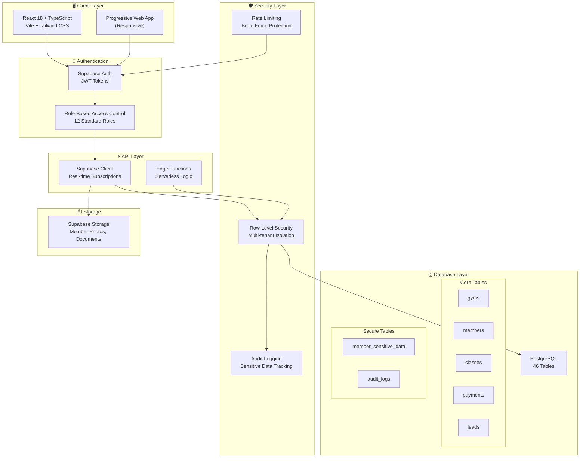
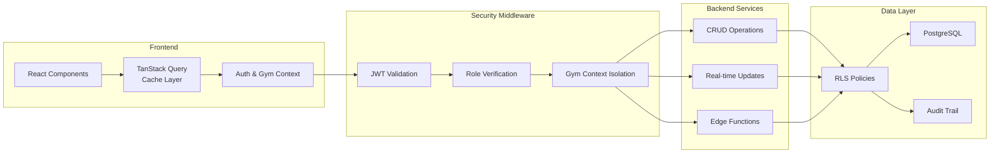
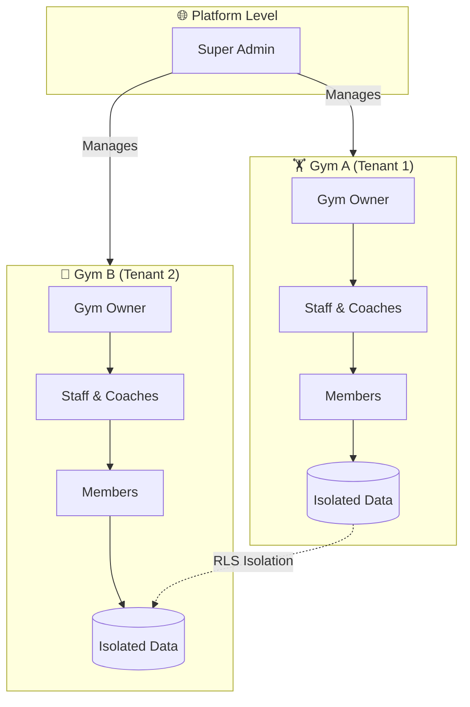
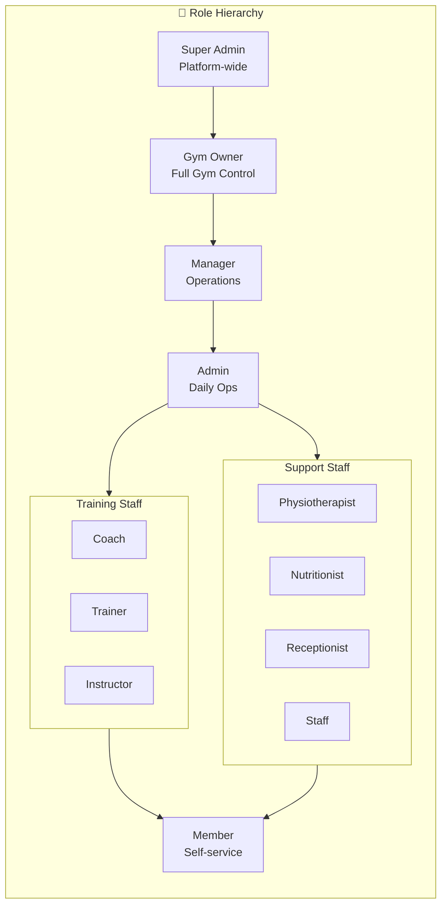

# Nzila Gym Manager | Gestor de Ginásios Nzila

> **EN**: A production-grade, multi-tenant gym management system built with modern web technologies. Designed for martial arts studios, CrossFit boxes, and fitness centers in Angola and beyond.

> **PT**: Um sistema de gestão de ginásios multi-tenant de nível profissional, construído com tecnologias web modernas. Desenvolvido para academias de artes marciais, boxes de CrossFit e centros de fitness em Angola e além.

[](LICENSE)
[](https://www.typescriptlang.org/)
[](https://reactjs.org/)
[](https://supabase.com)
[](https://github.com/clrogon/nzila-gym-manager)
[](SECURITY.md)

**Live Demo | Demo ao Vivo**: [nzila-gym-manager.vercel.app](https://nzila-gym-manager.vercel.app)

---

## 📊 Current Status | Estado Actual (January 2026) - v1.0.2

| Module | Status EN | Estado PT |
|--------|-----------|-----------|
| **Authentication** | ✅ Complete | ✅ Completo |
| **Member Management** | ✅ Complete | ✅ Completo |
| **Member Portal** | ✅ Complete | ✅ Completo |
| **Check-In System** | ✅ Complete | ✅ Completo |
| **Calendar/Scheduling** | ✅ Complete | ✅ Completo |
| **Class Booking** | ✅ Complete | ✅ Completo |
| **Disciplines & Ranks** | ✅ Complete | ✅ Completo |
| **Training & Workouts** | ✅ Complete | ✅ Completo |
| **Training Library** | ✅ Complete | ✅ Completo |
| **Payments/Invoices** | ✅ Complete | ✅ Completo |
| **Lead Pipeline (CRM)** | ✅ Complete | ✅ Completo |
| **POS/Inventory** | ✅ Complete | ✅ Completo |
| **Staff Management** | ✅ Complete | ✅ Completo |
| **Bank Reconciliation** | ✅ Complete | ✅ Completo |
| **Financial Reports** | ✅ Complete | ✅ Completo |
| **Security Hardening** | ✅ Complete | ✅ Completo |
| **Email Notifications** | ✅ Complete | ✅ Completo |
| **Settings** | ✅ Complete | ✅ Completo |
| **Super Admin** | ✅ Complete | ✅ Completo |
| **GDPR Compliance** | ✅ Complete | ✅ Completo |
| **Kiosk Mode** | ✅ Complete | ✅ Completo |
| **SMS/WhatsApp** | 📋 Planned | 📋 Planeado |

---

## 📋 Audit Reports | Relatórios de Auditoria (January 2026)

Comprehensive audits conducted for security, features, and code quality:
Auditorias completas para segurança, funcionalidades e qualidade de código:

| Audit Report | Descrição EN | Descrição PT | Rating |
|-------------|--------------|--------------|---------|
| [Security Audit](COMPREHENSIVE_SECURITY_AUDIT.md) | Complete security assessment with vulnerabilities and recommendations | Avaliação de segurança completa com vulnerabilidades e recomendações | ⭐⭐⭐⭐⭐ (4.5/5) |
| [Features Audit](FEATURES_AUDIT.md) | Feature functionality and ease of usage analysis | Análise de funcionalidades e facilidade de uso | ⭐⭐⭐⭐⭐ (4.5/5) |
| [Code Quality Audit](CODE_QUALITY_AUDIT.md) | Code quality, architecture, and best practices review | Revisão de qualidade de código, arquitetura e boas práticas | ⭐⭐⭐⭐ (4.0/5) |

### Audit Summary | Resumo da Auditoria

**Security**: ✅ Excellent (8.9/10) - Zero critical vulnerabilities, comprehensive RLS, rate limiting  
**Features**: ✅ Excellent (8.4/10) - 21 modules complete, competitive positioning  
**Code Quality**: ✅ Good (8.7/10) - Modern patterns, test coverage gap  

**Overall**: ⭐⭐⭐⭐⭐ (4.3/5) - Production-ready with minor improvements needed

---

## 🔐 Security Status | Estado de Segurança

**Latest Security Update: v1.0.1 (January 2025)**

| Security Issue | Status | Description |
|---------------|--------|-------------|
| PUBLIC_USER_DATA | ✅ Fixed | Profiles properly protected |
| EXPOSED_SENSITIVE_DATA | ✅ Fixed | Health data in secure table |
| MISSING_RLS_PROTECTION | ✅ Fixed | All views have RLS |

See [SECURITY.md](SECURITY.md) for full security documentation.

---

## 🎯 Overview | Visão Geral

### EN-US

**Nzila Gym Manager** is a comprehensive SaaS platform for managing modern fitness facilities. Built with security, scalability, and user experience as core principles, Nzila handles everything from member check-ins to financial reporting, class scheduling to rank promotions.

### PT-AO/PT-PT

**Nzila Gym Manager** é uma plataforma SaaS completa para gestão de instalações desportivas modernas. Construído com segurança, escalabilidade e experiência do utilizador como princípios fundamentais, o Nzila trata de tudo, desde check-ins de membros até relatórios financeiros, agendamento de aulas até promoções de graduação.

---

## ✨ Core Features | Funcionalidades Principais

### Member Management | Gestão de Membros
- **EN**: Complete profiles with photo, emergency contacts, health conditions • Family billing with tutor relationships • GDPR-compliant data handling • Membership plans with auto-expiration • Status management (Active, Suspended, Pending)
- **PT**: Perfis completos com foto, contactos de emergência, condições de saúde • Facturação familiar com relações de tutor • Tratamento de dados em conformidade com GDPR • Planos de associação com auto-expiração • Gestão de estado (Activo, Suspenso, Pendente)

### Check-In System | Sistema de Check-In
- **EN**: Fast member check-in/out logging • Real-time attendance tracking • Kiosk mode for self-service (in development)
- **PT**: Registo rápido de entrada/saída de membros • Rastreamento de presença em tempo real • Modo quiosque para auto-atendimento (em desenvolvimento)

### Class Scheduling & Calendar | Agendamento de Aulas & Calendário
- **EN**: Visual calendar with drag-drop class creation • Recurring classes with flexible rules • Coach assignment with conflict detection • Location-based scheduling • Class type library • Member booking with capacity limits • Discipline integration
- **PT**: Calendário visual com criação de aulas por arrastar e largar • Aulas recorrentes com regras flexíveis • Atribuição de treinador com detecção de conflitos • Agendamento baseado em localização • Biblioteca de tipos de aula • Reserva de membros com limites de capacidade • Integração com disciplinas

### Training & Progress | Treino & Progresso
- **EN**: Workout template builder with exercise library • Discipline-specific rank/belt system • Promotion history with certificates • Performance records and personal bests • Assigned workout tracking
- **PT**: Construtor de modelos de treino com biblioteca de exercícios • Sistema de graduação/faixa específico por disciplina • Histórico de promoções com certificados • Registos de desempenho e recordes pessoais • Rastreamento de treinos atribuídos

### Financial Management | Gestão Financeira
- **EN**: Payment processing (Multicaixa, cash, bank transfer) • Invoice generation with line items • Discount/coupon system • Revenue reporting and analytics • Bank reconciliation • Multicaixa proof parsing
- **PT**: Processamento de pagamentos (Multicaixa, dinheiro, transferência bancária) • Geração de facturas com itens de linha • Sistema de descontos/cupões • Relatórios de receitas e análises • Reconciliação bancária • Parsing de comprovativos Multicaixa

### Sales CRM | CRM de Vendas
- **EN**: Lead pipeline management (Kanban board) • Lead source tracking • Task assignment for follow-ups • Conversion tracking to members
- **PT**: Gestão de pipeline de leads (quadro Kanban) • Rastreamento de fonte de leads • Atribuição de tarefas para seguimento • Rastreamento de conversão para membros

### Inventory & POS | Inventário & PDV
- **EN**: Product catalog (supplements, gear, apparel) • Stock management with low-stock alerts • Point-of-sale transactions • Asset tracking (equipment maintenance)
- **PT**: Catálogo de produtos (suplementos, equipamento, vestuário) • Gestão de stock com alertas de stock baixo • Transacções de ponto de venda • Rastreamento de activos (manutenção de equipamento)

### Staff Management | Gestão de Staff
- **EN**: Role-based access control (12 international standard roles) • Staff certifications with expiry tracking • Coach scheduling and availability
- **PT**: Controlo de acesso baseado em funções (12 funções padrão internacional) • Certificações de staff com rastreamento de expiração • Agendamento e disponibilidade de treinadores

### Audit & Compliance | Auditoria & Conformidade
- **EN**: Immutable audit logs for sensitive operations • GDPR data protection features • Field-level security • Secure view patterns for member data
- **PT**: Registos de auditoria imutáveis para operações sensíveis • Funcionalidades de protecção de dados GDPR • Segurança ao nível de campo • Padrões de visualização segura para dados de membros

---

## 🏗️ Architecture | Arquitectura

### System Architecture Diagram | Diagrama de Arquitectura do Sistema



### Data Flow Architecture | Arquitectura de Fluxo de Dados



### Multi-Tenant Design | Design Multi-Tenant

**EN**: Nzila is architected as a true multi-tenant SaaS with isolated gym data, Row-Level Security (RLS) enforcement, Super Admin platform management, and support for users belonging to multiple gyms with different roles.

**PT**: O Nzila é arquitectado como um verdadeiro SaaS multi-tenant com dados de ginásio isolados, imposição de Row-Level Security (RLS), gestão de plataforma Super Admin e suporte para utilizadores pertencentes a múltiplos ginásios com funções diferentes.



### Technology Stack | Stack Tecnológico

| Component | Technology | Purpose EN | Propósito PT |
|-----------|-----------|------------|--------------|
| **Frontend** | React 18 + TypeScript | Type-safe UI components | Componentes UI type-safe |
| **Build Tool** | Vite | Fast development + HMR | Desenvolvimento rápido + HMR |
| **Styling** | Tailwind CSS + shadcn/ui | Utility-first design system | Sistema de design utility-first |
| **Backend** | Supabase (Lovable Cloud) | PostgreSQL + Auth + Edge Functions | PostgreSQL + Auth + Edge Functions |
| **State Management** | TanStack Query | Server state caching | Cache de estado do servidor |
| **Routing** | React Router v7 | Client-side navigation | Navegação client-side |
| **Validation** | Zod | Schema validation | Validação de esquema |
| **Date Handling** | date-fns + date-fns-tz | Timezone-aware dates | Datas com consciência de fuso horário |

### Security Model | Modelo de Segurança



**Role Hierarchy | Hierarquia de Funções** (12 International Standard Roles):

| Role | EN Description | PT Descrição |
|------|---------------|--------------|
| **Super Admin** | Platform-wide access, gym owner onboarding | Acesso a toda a plataforma, integração de proprietários |
| **Gym Owner** | Full gym management, billing, staff assignment | Gestão completa do ginásio, facturação, atribuição de staff |
| **Manager** | Operations management, staff supervision | Gestão de operações, supervisão de staff |
| **Admin** | Member data, financials, daily operations | Dados de membros, finanças, operações diárias |
| **Coach** | Class creation, training programs, member progress | Criação de aulas, programas de treino, progresso de membros |
| **Trainer** | Personal training, workout assignments | Treino pessoal, atribuição de treinos |
| **Instructor** | Group class delivery, attendance | Aulas de grupo, presença |
| **Physiotherapist** | Injury assessment, recovery tracking | Avaliação de lesões, rastreamento de recuperação |
| **Nutritionist** | Diet plans, member consultations | Planos de dieta, consultas de membros |
| **Receptionist** | Check-ins, payments, member registration | Check-ins, pagamentos, registo de membros |
| **Staff** | General operations, limited access | Operações gerais, acesso limitado |
| **Member** | Self-service profile, class bookings | Perfil de auto-serviço, reservas de aulas |

---

## 🚀 Getting Started | Começar

### Prerequisites | Pré-requisitos
- Node.js 18+ (LTS recommended | LTS recomendado)
- npm or pnpm

### Installation | Instalação

**1. Clone the repository | Clonar o repositório**
```bash
git clone https://github.com/clrogon/nzila-gym-manager.git
cd nzila-gym-manager
```

**2. Install dependencies | Instalar dependências**
```bash
npm install
```

**3. Start development server | Iniciar servidor de desenvolvimento**
```bash
npm run dev
# Access at | Aceder em: http://localhost:5173
```

---

## 📁 Project Structure | Estrutura do Projecto

```
nzila-gym-manager/
├── src/
│   ├── components/        # Reusable UI components | Componentes UI reutilizáveis
│   │   ├── ui/            # shadcn/ui base components
│   │   ├── common/        # Shared components (ErrorBoundary, RequirePermission)
│   │   ├── training/      # Training module components
│   │   ├── calendar/      # Calendar components
│   │   └── dashboard/     # Dashboard widgets
│   ├── pages/             # Route pages | Páginas de rota
│   ├── modules/           # Feature modules (auth, booking, payments, etc.)
│   ├── hooks/             # Custom React hooks (useRBAC, useMobile)
│   ├── lib/               # Utilities (parsers, validators, PDF service)
│   ├── contexts/          # React context providers (Auth, Gym)
│   └── integrations/      # Supabase client & types
├── supabase/
│   ├── migrations/        # Database schema versions
│   └── functions/         # Edge Functions (serverless)
├── public/                # Static assets
└── workflows/             # GitHub Actions CI/CD
```

---

## 🔐 Security & Compliance | Segurança & Conformidade

### GDPR Compliance | Conformidade GDPR
- **EN**: Explicit consent tracking • Data anonymization support • Right to erasure • Audit trail for data access
- **PT**: Rastreamento de consentimento explícito • Suporte para anonimização de dados • Direito ao apagamento • Trilha de auditoria para acesso a dados

### Data Protection | Protecção de Dados
- **EN**: Sensitive fields in separate secure table • Secure views for member data • Encrypted connections (TLS) • No PII in logs • Row-Level Security on all tables • Audit logging for sensitive data access
- **PT**: Campos sensíveis em tabela segura separada • Visualizações seguras para dados de membros • Conexões encriptadas (TLS) • Sem PII em logs • Row-Level Security em todas as tabelas • Registo de auditoria para acesso a dados sensíveis

---

## 🛠️ Development | Desenvolvimento

### Available Scripts | Scripts Disponíveis

```bash
npm run dev          # Start development | Iniciar desenvolvimento
npm run build        # Production build | Build de produção
npm run preview      # Preview build | Pré-visualizar build
npm run lint         # Run ESLint
npm run type-check   # TypeScript validation | Validação TypeScript
```

---

## 🤝 Contributing | Contribuir

**EN**: We welcome contributions! Please read [CONTRIBUTING.md](CONTRIBUTING.md) for our development workflow, coding standards, and pull request process.

**PT**: Acolhemos contribuições! Por favor, leia [CONTRIBUTING.md](CONTRIBUTING.md) para o nosso fluxo de trabalho de desenvolvimento, padrões de codificação e processo de pull request.

---

## 📄 License | Licença

This project is licensed under the MIT License - see [LICENSE](LICENSE) file for details.

Este projecto está licenciado sob a Licença MIT - veja o ficheiro [LICENSE](LICENSE) para detalhes.

---

## 🆘 Support | Suporte

### Documentation | Documentação

| Audience | Guide | Language |
|-----------|--------|----------|
| **Gym Members** | [User Guide](docs/USER_GUIDE.md) | EN/PT |
| **Gym Owners/Managers** | [Admin Guide](docs/ADMIN_GUIDE.md) | EN/PT |
| **Trainers/Coaches/Staff** | [Staff Guide](docs/STAFF_GUIDE.md) | EN/PT |
| **Developers** | [Documentation Index](docs/README.md) | EN |

### Technical Documentation | Documentação Técnica

- **[README](README.md)** - Project overview, architecture, and setup
- **[SECURITY.md](SECURITY.md)** - Security policies and compliance
- **[SECURITY_HARDENING.md](SECURITY_HARDENING.md)** - Security implementation details
- **[DISCIPLINE_ENHANCEMENTS.md](DISCIPLINE_ENHANCEMENTS.md)** - Discipline and rank system features

### Contact | Contacto

- **Issues**: [GitHub Issues](https://github.com/clrogon/nzila-gym-manager/issues)
- **Email**: support@nzila.ao | suporte@nzila.ao

---

## 🙏 Acknowledgments | Agradecimentos

- Built with [Supabase](https://supabase.com) via Lovable Cloud
- UI components from [shadcn/ui](https://ui.shadcn.com)
- Icons from [Lucide React](https://lucide.dev)
- **EN**: Inspired by the fitness community in Luanda, Angola
- **PT**: Inspirado pela comunidade fitness em Luanda, Angola

---

## 🗺️ Roadmap | Roteiro

**EN**: See [ROADMAP.md](ROADMAP.md) for planned features and timeline.

**PT**: Veja [ROADMAP.md](ROADMAP.md) para funcionalidades planeadas e cronograma.

---

**Made with ❤️ for the fitness community | Feito com ❤️ para a comunidade fitness**
