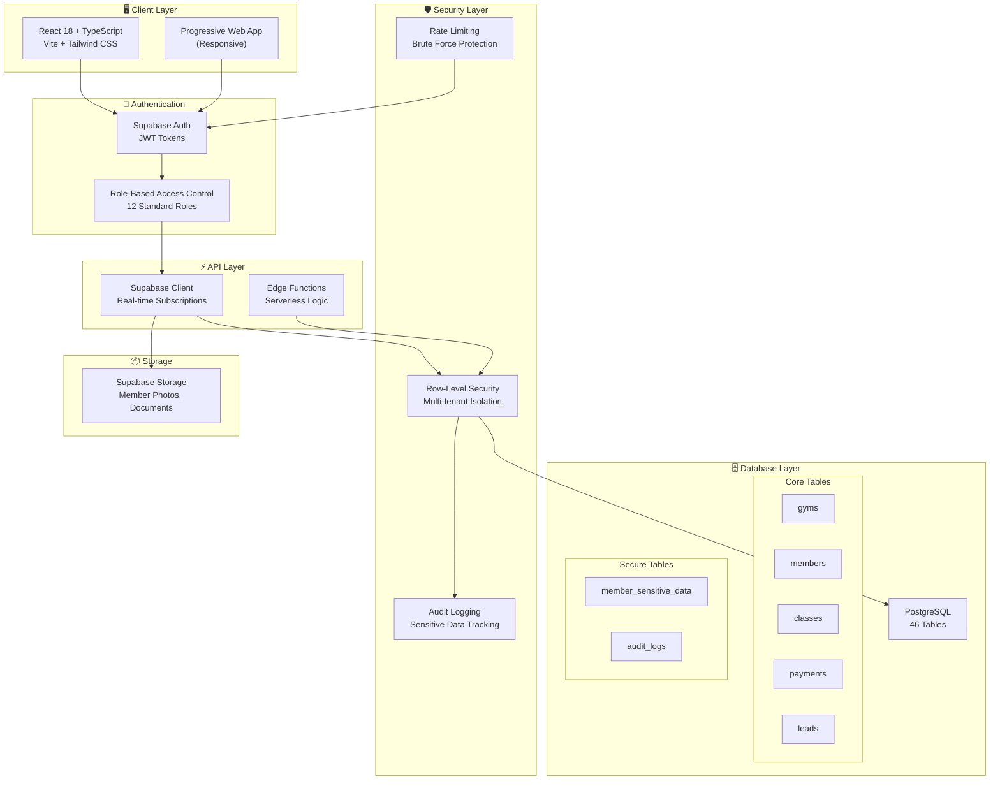
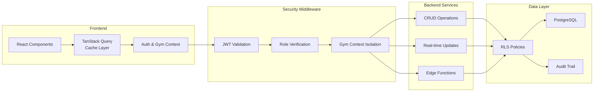

# Nzila Gym Manager | Gestor de Ginásios Nzila

> **EN**: A production-grade, multi-tenant gym management system built with modern web technologies. Designed for martial arts studios, CrossFit boxes, and fitness centers in Angola and beyond.
>
> **PT**: Um sistema de gestão de ginásios multi-tenant de nível profissional, construído com tecnologias web modernas. Desenvolvido para academias de artes marciais, boxes de CrossFit e centros de fitness em Angola e além.

[](LICENSE)
[](https://www.typescriptlang.org/)
[](https://reactjs.org/)
[](https://supabase.com)
[](https://github.com/clrogon/nzila-gym-manager)
[](SECURITY.md)

**Live Demo | Demo ao Vivo**: [nzila-gym-manager.vercel.app](https://nzila-gym-manager.vercel.app)

---

## 📊 Current Status | Estado Actual (January 2026)

| Module | Status EN | Estado PT |
| :--- | :--- | :--- |
| **Authentication** | ✅ Complete | ✅ Completo |
| **Member Management** | ✅ Complete | ✅ Completo |
| **Check-In System** | ✅ Complete | ✅ Completo |
| **Calendar/Scheduling** | ✅ Complete | ✅ Completo |
| **Disciplines & Ranks** | ✅ Complete | ✅ Completo |
| **Training & Workouts** | ✅ Complete | ✅ Completo |
| **Payments/Invoices** | ✅ Complete | ✅ Completo |
| **Lead Pipeline (CRM)** | ✅ Complete | ✅ Completo |
| **POS/Inventory** | ✅ Complete | ✅ Completo |
| **Staff Management** | ✅ Complete | ✅ Completo |
| **Bank Reconciliation** | ✅ Complete | ✅ Completo |
| **Financial Reports** | ✅ Complete | ✅ Completo |
| **Security Hardening** | ✅ Complete | ✅ Completo |
| **GDPR Compliance** | ✅ Implemented | ✅ Implementado |
| **Email Notifications** | ✅ Refactored (Edge Ready) | ✅ Refactorizado (Pronto para Edge) |
| **Kiosk Mode** | 🚧 In Development | 🚧 Em Desenvolvimento |

---

## 🔐 Security Status | Estado de Segurança

**Latest Security Update: v1.1.0 (January 2026)**

| Security Issue | Status | Description |
| :--- | :--- | :--- |
| PUBLIC_USER_DATA | ✅ Fixed | Profiles properly protected |
| EXPOSED_SENSITIVE_DATA | ✅ Fixed | Health data in secure table |
| MISSING_RLS_PROTECTION | ✅ Fixed | All views have RLS |
| HARDCODED_SECRETS | ✅ Fixed | Removed .env from repository |
| INSECURE_LOGGING | ✅ Fixed | Cleaned up production console logs |

See [SECURITY.md](SECURITY.md) for full security documentation.

---

## 🎯 Overview | Visão Geral

### EN-US

**Nzila Gym Manager** is a comprehensive SaaS platform for managing modern fitness facilities. Built with security, scalability, and user experience as core principles, Nzila handles everything from member check-ins to financial reporting, class scheduling to rank promotions.

### PT-AO/PT-PT

**Nzila Gym Manager** é uma plataforma SaaS completa para gestão de instalações desportivas modernas. Construído com segurança, escalabilidade e experiência do utilizador como princípios fundamentais, o Nzila trata de tudo, desde check-ins de membros até relatórios financeiros, agendamento de aulas até promoções de graduação.

---

## ✨ Core Features | Funcionalidades Principais

### Member Management | Gestão de Membros
- **EN**: Complete profiles with photo, emergency contacts, health conditions • Family billing with tutor relationships • GDPR-compliant data handling • Membership plans with auto-expiration • Status management (Active, Suspended, Pending)
- **PT**: Perfis completos com foto, contactos de emergência, condições de saúde • Facturação familiar com relações de tutor • Tratamento de dados em conformidade com GDPR • Planos de associação com auto-expiração • Gestão de estado (Activo, Suspenso, Pendente)

### Check-In System | Sistema de Check-In
- **EN**: Fast member check-in/out logging • Real-time attendance tracking • Kiosk mode for self-service (in development)
- **PT**: Registo rápido de entrada/saída de membros • Rastreamento de presença em tempo real • Modo quiosque para auto-atendimento (em desenvolvimento)

### Class Scheduling & Calendar | Agendamento de Aulas & Calendário
- **EN**: Visual calendar with drag-drop class creation • Recurring classes with flexible rules • Coach assignment with conflict detection • Location-based scheduling • Class type library • Member booking with capacity limits • Discipline integration
- **PT**: Calendário visual com criação de aulas por arrastar e largar • Aulas recorrentes com regras flexíveis • Atribuição de treinador com detecção de conflitos • Agendamento baseado em localização • Biblioteca de tipos de aula • Reserva de membros com limites de capacidade • Integração com disciplinas

### Training & Progress | Treino & Progresso
- **EN**: Workout template builder with exercise library • Discipline-specific rank/belt system • Promotion history with certificates • Performance records and personal bests • Assigned workout tracking
- **PT**: Construtor de modelos de treino com biblioteca de exercícios • Sistema de graduação/faixa específico por disciplina • Histórico de promoções com certificados • Registos de desempenho e recordes pessoais • Rastreamento de treinos atribuídos

### Financial Management | Gestão Financeira
- **EN**: Payment processing (Multicaixa, cash, bank transfer) • Invoice generation with line items • Discount/coupon system • Revenue reporting and analytics • Bank reconciliation • Multicaixa proof parsing
- **PT**: Processamento de pagamentos (Multicaixa, dinheiro, transferência bancária) • Geração de facturas com itens de linha • Sistema de descontos/cupões • Relatórios de receitas e análises • Reconciliação bancária • Parsing de comprovativos Multicaixa

### Sales CRM | CRM de Vendas
- **EN**: Lead pipeline management (Kanban board) • Lead source tracking • Task assignment for follow-ups • Conversion tracking to members
- **PT**: Gestão de pipeline de leads (quadro Kanban) • Rastreamento de fonte de leads • Atribuição de tarefas para seguimento • Rastreamento de conversão para membros

### Inventory & POS | Inventário & PDV
- **EN**: Product catalog (supplements, gear, apparel) • Stock management with low-stock alerts • Point-of-sale transactions • Asset tracking (equipment maintenance)
- **PT**: Catálogo de produtos (suplementos, equipamento, vestuário) • Gestão de stock com alertas de stock baixo • Transacções de ponto de venda • Rastreamento de activos (manutenção de equipamento)

### Staff Management | Gestão de Staff
- **EN**: Role-based access control (12 international standard roles) • Staff certifications with expiry tracking • Coach scheduling and availability
- **PT**: Controlo de acesso baseado em funções (12 funções padrão internacional) • Certificações de staff com rastreamento de expiração • Agendamento e disponibilidade de treinadores

### Audit & Compliance | Auditoria & Conformidade
- **EN**: Immutable audit logs for sensitive operations • GDPR data protection features • Field-level security • Secure view patterns for member data
- **PT**: Registos de auditoria imutáveis para operações sensíveis • Funcionalidades de protecção de dados GDPR • Segurança ao nível de campo • Padrões de visualização segura para dados de membros

---

## 🏗️ Architecture | Arquitectura

### System Architecture Diagram | Diagrama de Arquitectura do Sistema



### Data Flow Architecture | Arquitectura de Fluxo de Dados


### Multi-Tenant Design | Design Multi-Tenant

**EN**: Nzila is architected as a true multi-tenant SaaS with isolated gym data, Row-Level Security (RLS) enforcement, Super Admin platform management, and support for users belonging to multiple gyms with different roles.

**PT**: O Nzila é arquitectado como um verdadeiro SaaS multi-tenant com dados de ginásio isolados, imposição de Row-Level Security (RLS), gestão de plataforma Super Admin e suporte para utilizadores pertencentes a múltiplos ginásios com funções diferentes.

---

## 🚀 Getting Started | Como Começar

### Prerequisites | Pré-requisitos
- Node.js 18+
- Supabase Account

### Installation | Instalação
1. Clone the repository:
   ```bash
   git clone https://github.com/clrogon/nzila-gym-manager.git
   ```
2. Install dependencies:
   ```bash
   pnpm install
   ```
3. Set up environment variables:
   Copy `.env.example` to `.env` and fill in your Supabase credentials.
4. Start the development server:
   ```bash
   pnpm dev
   ```

---

## 📄 License | Licença
This project is licensed under the MIT License - see the [LICENSE](LICENSE) file for details.

---

## 🤝 Contributing | Contribuir
Please read [CONTRIBUTING.md](CONTRIBUTING.md) for details on our code of conduct and the process for submitting pull requests.

---

## 📞 Support | Suporte
For support, please email support@nzila.ao or join our Discord community.
