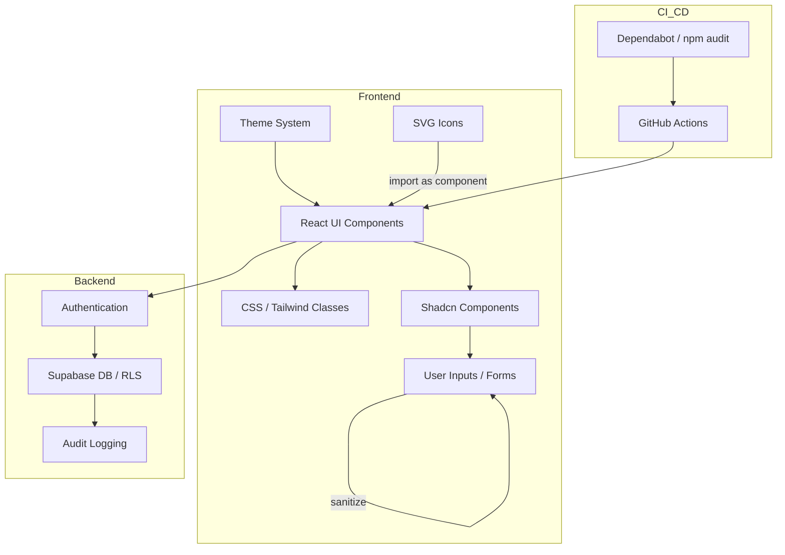

# Nzila Gym Manager - Security Hardening Guide

Este documento reúne **todas as medidas de segurança** aplicáveis ao projeto Nzila Gym Manager (Vite + React + TypeScript + Tailwind + Shadcn), detalhando **o que corrigir, onde e como**.

---

## 1. Dependências e Supply Chain

**Problema:** Dependências desatualizadas ou mal auditadas.

**Ação:**
1. Habilitar Dependabot:
   ```yaml
   # .github/dependabot.yml
   version: 2
   updates:
     - package-ecosystem: "npm"
       directory: "/"
       schedule:
         interval: "weekly"
       open-pull-requests-limit: 10
       labels:
         - "dependencies"
       reviewers:
         - "clrogon"
       commit-message:
         prefix: "deps"
         include: "scope"
   ```
2. Rodar auditoria automatizada:
   ```bash
   npm audit fix
   ```
3. Criar workflow no GitHub Actions:
```yaml
name: Security Audit
on:
  push:
  pull_request:
jobs:
  audit:
    runs-on: ubuntu-latest
    steps:
      - uses: actions/checkout@v4
      - uses: actions/setup-node@v4
        with:
          node-version: 20
      - run: npm ci
      - run: npm audit --omit=dev
```

---

## 2. Supabase - Row Level Security (RLS)

**Problema:** Todos os dados podem ser acessados sem restrição.

**Ação:**
1. Ativar RLS em todas as tabelas com dados sensíveis.
2. Criar políticas:
```sql
-- Leitura própria
create policy "read_own_rows"
on members for select
to authenticated
using (auth.uid() = user_id);

-- Inserção própria
create policy "insert_own_rows"
on members for insert
to authenticated
with check (auth.uid() = user_id);
```
3. Repetir para todas as tabelas que armazenem informações pessoais.

---

## 3. Proteção de rotas

**Problema:** Qualquer utilizador pode aceder a páginas protegidas.

**Ação:**
1. Criar `src/components/ProtectedRoute.tsx`:
```tsx
import { Navigate } from "react-router-dom";
import { supabase } from "../lib/supabaseClient";
import { useEffect, useState } from "react";

export function ProtectedRoute({ children }) {
  const [session, setSession] = useState(null);

  useEffect(() => {
    supabase.auth.getSession().then(({ data }) => setSession(data.session));
  }, []);

  if (session === null) return null; // loading
  return session ? children : <Navigate to="/login" replace />;
}
```
2. Envolver rotas críticas com `<ProtectedRoute>`.

---

## 4. Sanitização de Inputs e XSS

**Problema:** Conteúdo dinâmico pode gerar XSS.

**Ação:**
1. Instalar DOMPurify:
```bash
npm i dompurify
```
2. Sempre sanitizar:
```tsx
import DOMPurify from "dompurify";
<div dangerouslySetInnerHTML={{ __html: DOMPurify.sanitize(content) }} />
```
3. Para inputs:
```tsx
export function SafeInput({ value, onChange, ...props }) {
  const safeValue = typeof value === "string" ? value.replace(/\</g, "") : value;
  return <input {...props} value={safeValue} onChange={onChange} />;
}
```

---

## 5. Variáveis de ambiente e segredos

**Problema:** Vite expõe `VITE_*` no frontend.

**Ação:**
1. `.env` nunca deve conter chaves sensíveis:
```
VITE_API_URL=https://api.example.com
```
2. Credenciais de admin ou service role devem estar em **Supabase Edge Functions** ou backend.

---

## 6. Headers de segurança

**Problema:** Falta CSP, clickjacking, referrer leaks.

**Ação (Vercel):**
1. Criar `vercel.json`:
```json
{
  "headers": [
    {
      "source": "/(.*)",
      "headers": [
        { "key": "Content-Security-Policy", "value": "default-src 'self'; img-src * blob: data:; style-src 'self' 'unsafe-inline'; script-src 'self';" },
        { "key": "X-Frame-Options", "value": "DENY" },
        { "key": "Referrer-Policy", "value": "strict-origin-when-cross-origin" }
      ]
    }
  ]
}
```

---

## 7. Tailwind e UI Layer

**Problema:** Possível injeção de classes via props ou inputs dinâmicos.

**Ação:**
1. Criar `src/lib/cn.ts`:
```ts
import { clsx } from "clsx";
import { twMerge } from "tailwind-merge";

export function cn(...inputs: any[]) {
  return twMerge(clsx(inputs));
}
```
2. Substituir todos os `className={props.className}` por:
```tsx
className={cn("p-4 bg-white", props.className)}
```

---

## 8. SVG / Icons

**Problema:** Scripts escondidos em SVG podem ser executados.

**Ação:**
- Importar SVG como React component:
```tsx
import Logo from "../assets/logo.svg?react";
```
- Nunca usar `` para ícones externos.

---

## 9. Temas e CSS

**Problema:** FOUC, leaks de preferência do utilizador, animações pesadas.

**Ação:**
1. Inline script no `index.html`:
```html
<script>
  const theme = localStorage.getItem("theme");
  if (theme === "dark") document.documentElement.classList.add("dark");
</script>
```
2. Evitar dados sensíveis em classes ou atributos CSS.
3. Animations devem ser GPU-friendly:
```css
transform: translateZ(0);
```

---

## 10. Logging e Audit Trail

**Ação:**
1. Criar tabela `audit_log`:
```sql
create table audit_log (
  id bigserial primary key,
  user_id uuid,
  table_name text,
  action text,
  timestamp timestamptz default now(),
  row_data jsonb
);
```
2. Trigger para cada tabela sensível.

---
---

## ✅ Visual Checklist (Mermaid)

Este checklist visual representa rapidamente:
- **Frontend**: UI, Tailwind, Shadcn, inputs, temas, SVGs
- **Backend**: Auth, RLS, logs
- **Supply Chain / CI-CD**: Dependabot, Actions

# Fim do Security Hardening
Seguindo estas instruções, o Nzila Gym Manager estará **fortemente protegido** em frontend, backend (Supabase), dependências e UI layer.

